README NGS project.

## Introduction: 
Argonauts are a proteins family involved in gene silencing, they recruit miRNAs which are small RNAs used as guides to find the target RNA and destroy it. 

C.elegans has 25 different Argonaute proteines, these interact with various miRNAs. 

*Brown et al. 2017* generated mutants of several Argonaute proteins and sequenced their transcriptomes to compare them to the wild type. 

Nevertheless, *C. elegans* being a fast developing organism, individuals from a sample can have various ages. Therefore there is an impact of the development stage in the variation observed between strains. A cutting edge tool will be used to assess the degree of impact of development on the results. 

## Software:

### OS
Ubuntu 20.04 LTS.

### Tools: 
- sratoolkit.2.10.0 
- FastQC v0.11.8
- MultiQC 1.9
- Trimmomatic O.39
- Salmon 0.14.1
- RAPToR 1.1.4

## RNA-seq data download: 

Link to the data (Geo database, accession code: GSE98935) `https://www.ncbi.nlm.nih.gov/geo/query/acc.cgi?acc=GSE98935`

Strains (Subset of the article's data): WT, alg-2(ok304) II (Argonaute 2 mutant) and alg-5(ram2) I (Argonaute 5 mutant). 
There are 3 replicates of each strain. 

Data was downloaded using the **Download_data.sh** script. Using the fastq-dump command. 

Fasta def lines were changed (defline-seq and defline-qual): 

- The sequence defline contain: The accession number, the spot id and the read number 

- The quality defline contain à + symbol. 

## Control the reads quality:

### 1) Fastqc analysis:
We used **Fastqc.sh** (one report per sample). Principal command: 

```{bash, eval=FALSE}
fastqc $file -o . -t 6
```

### 2) Multiqc analysis:
We used **Multiqc.sh** (on Fastqc directory output, one report for all samples). Principal command: 

```{bash, eval=FALSE}
multiqc $data/* -o . 
```

### 3) Results: 

Adapters sequences are present in our reads, that's why in the next step we will remove them. 

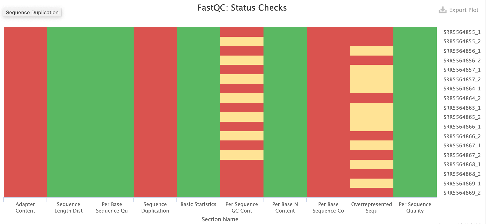

## Remove adapters from reads: 

### 1) Find adapters sequences:

Adapters' sequences were found in the supplementary data of Brown *et al*, 2017.

We generated reverse complement sequences using the online tool: `http://reverse-complement.com/`

Sequences were written on a Fasta file: **Adapter_sequences.fa**

### 2) Use Trimmomatic to remove adapters:

We used **Trimmomatic.sh**. Principal command: 

```{bash, eval=FALSE}
java -jar $TRIMMOMATIC_JAR PE -phred33 $input_1 $input_2 $output_1_paired \
  $output_1_unpaired $output_2_paired $output_2_unpaired ILLUMINACLIP:$adapter:2:30:10\
  LEADING:3 TRAILING:3 SLIDINGWINDOW:4:15 
```

ILLUMINACLIP remove adapters, LEADING remove leading low quality bases, TRAILING remove trailing low quality bases, SLIDINGWINDOW scan the read with a 4-base sliding window and cut when the average quality per base drops below 15. 

Trimmomatic generate two types of outputs, paired sequences (R1+R2) and unpaired sequences (R1 or R2 alone). For the rest of the analysis we will only keep paired sequences.

### 3) Control the reads quality after trimming:

I combined the two scripts of **Fastqc.sh** and **Multiqc.sh** to form the **Control_qual_trim.sh**.
We see on the Multiqc report that there are no (or almost no) more adapters , and that the read lengths are not as homogeneous as before. 

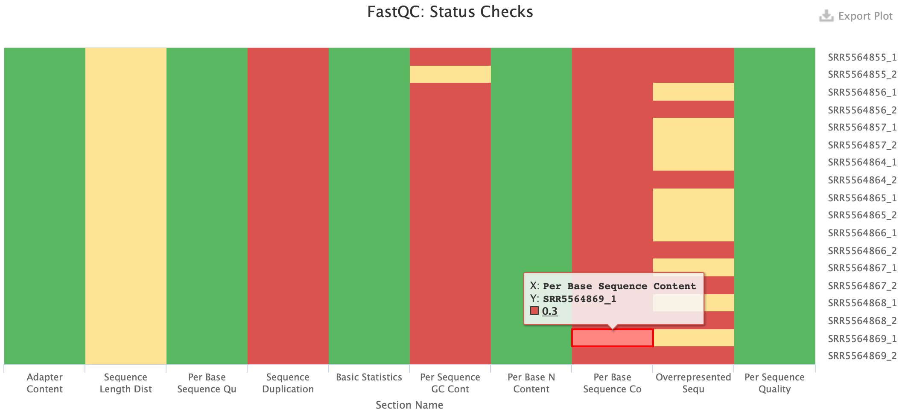

## Transcript expression quantification: 

### 1) Get the reference transcriptome:

The reference transcriptome of *C.elegans* was downloaded: `https://www.ensembl.org/info/data/ftp/index.html`

We used the wget command with this link:  `ftp://ftp.ensembl.org/pub/release-101/fasta/caenorhabditis_elegans/cdna/Caenorhabditis_elegans.WBcel235.cdna.all.fa.gz`

Create an index using the **Transcriptome_index.sh** script

### 2) Run Salmon analysis: 

We used Salmon to quantify the expression of transcripts in each sample:

Run salmon on experimental data using **Salmon.sh**. Principal command: 

```{bash, eval=FALSE}
salmon quant -i $data/index_transcriptome -l A \
         -1 $input_1 \
         -2 $input_2 \
         -p 8 --validateMappings -o $quants/${name}_quant
```

-l is for the library type. 
-p is the number of threads that will be used for quasi mapping, quantification and bootstrapping. 
--validateMapping use a more sensitive and accurate mapping algorithm and run an extension alignment dynamic program on the potential mappings it produces.

### 3) Generate a Multiqc report with Salmon output data: 

We used the **Multiqc_after_salmon.sh** script. 

*Ajouter captures du rapport multiqc*

## Import data:

We used tximport to import Salmon quantifications, it creates a matrix with abundance, counts and transcript length. 
After that, we put the matrix in a R object, so it's possible to load the object for future use. 

The script is: **Tximport.R**

## Differential expression analyses: 

### 1) Run DESeq: 
DESeq runs a statistical test on gene expression between WT and mutants. 
First we estimate the variance from the replicates of each condition. 
We use counts data with DESeq. 

We adapted the matrix to DESeq and set pvalue to 0.05 (as done in the paper). 

The WT dataset is the reference, if the Log2 FoldChange is >0 then the genes are upregulated in the mutant. If Log2 FoldChange is <0 then the genes are downregulated in the mutant. 

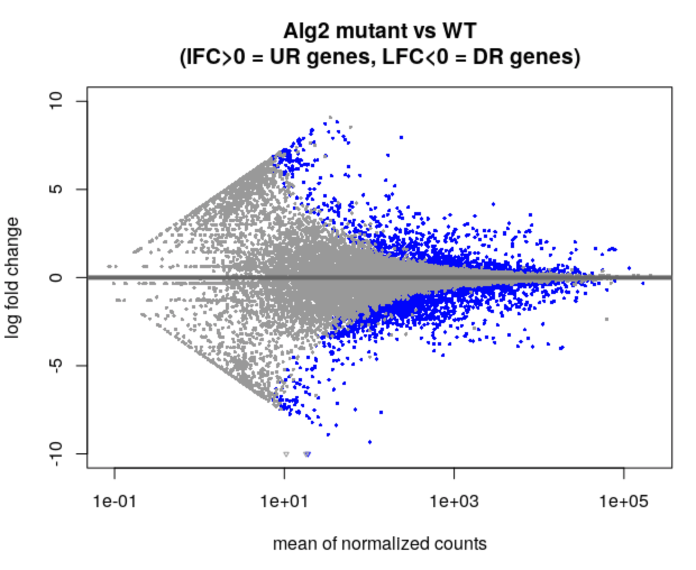{width=60%}

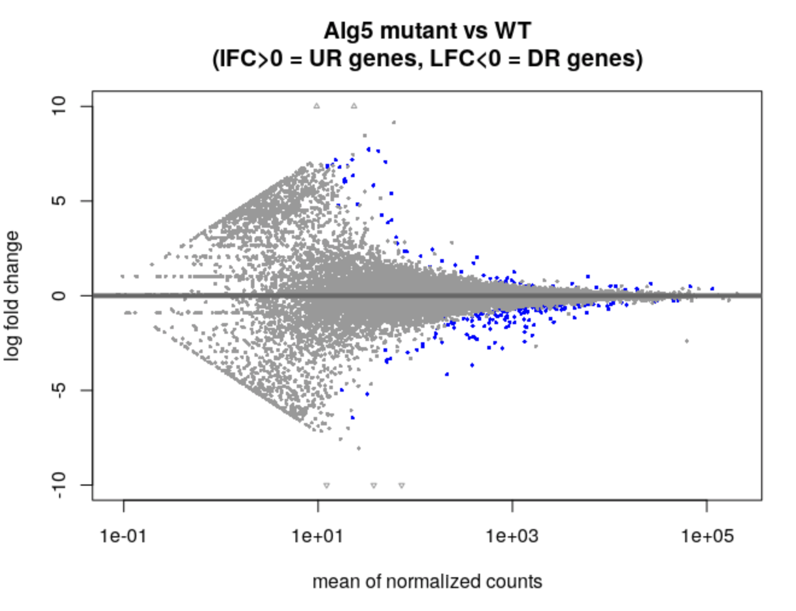{width=60%}

### 2) Gene ontology enrichment: 
We used wormbase enrichment tool to assess the enrichment of mutants upregulated and downregulated genes. 

#### 1- alg2 mutant: 

Upregulated genes: 

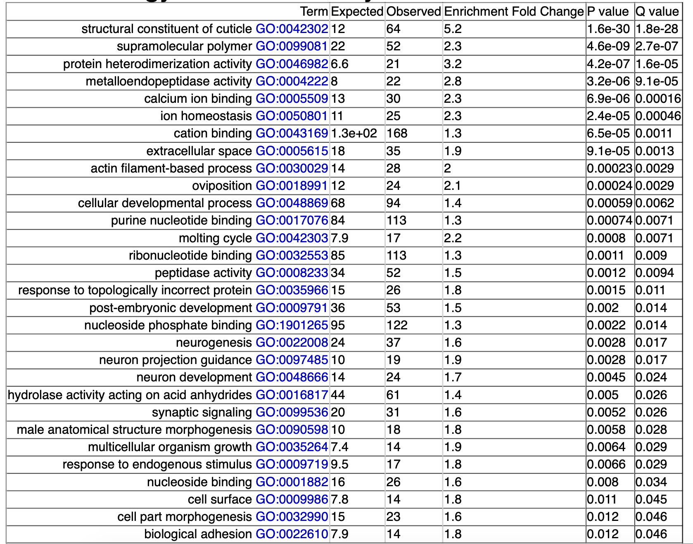{width=60%}
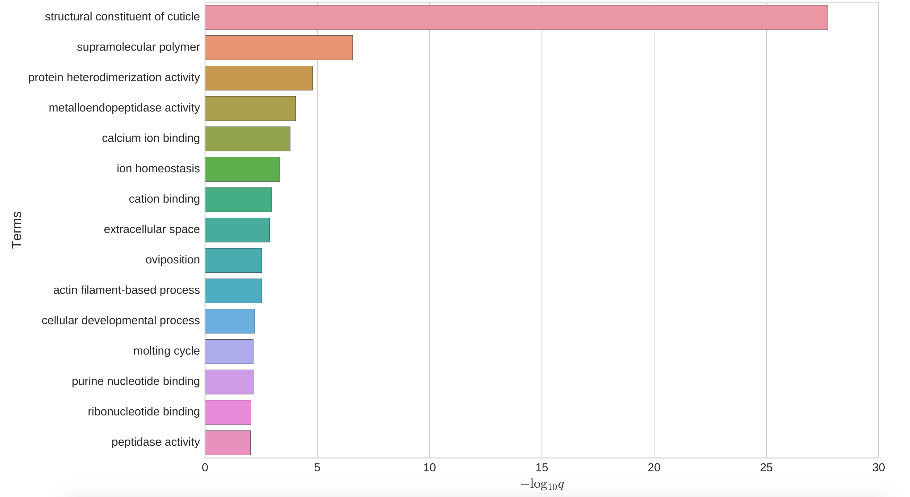{width=60%}

Downregulated genes: 

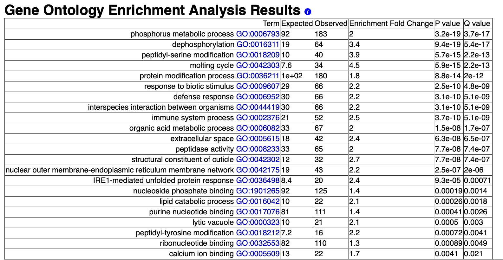{width=60%}
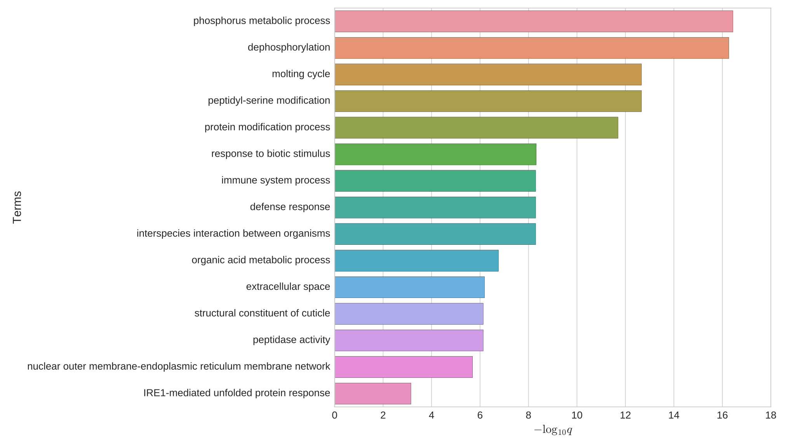{width=60%}

#### 2- alg5 mutant: 

Upregulated genes: 

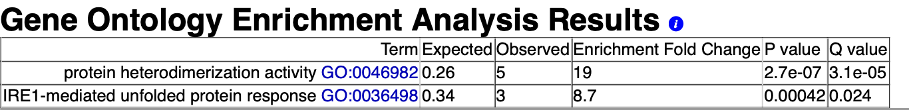{width=60%}
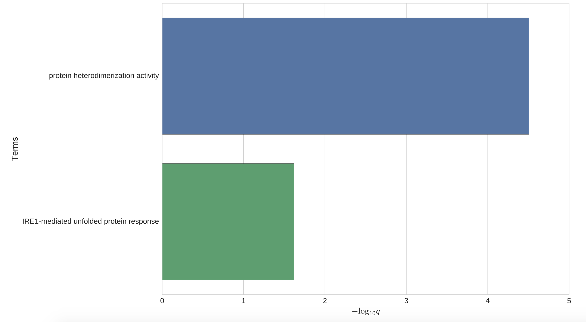{width=60%}

Downregulated genes: 

{width=60%}
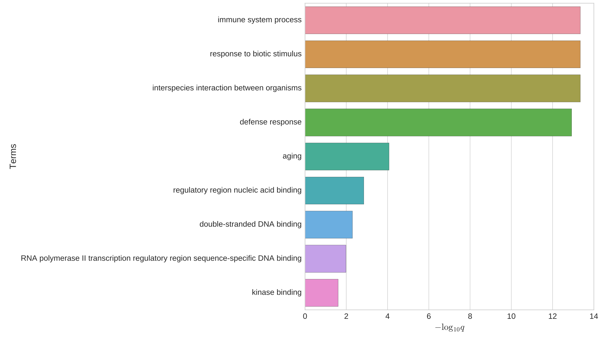{width=60%}

## Evaluate the impact of development: 

### 1) Install RAPTOR and wormRef on R: 

```Bash
BiocManager::install("limma")
devtools::install_github("LBMC/RAPToR", build_vignettes = TRUE) devtools::install_github("LBMC/wormRef")
```

### 2) Load wormref: 
We choose: **cell larval to Young Adult** as the right wormRef dataset because our samples are at L4 stage and this dataset covers it. 
We used 500 as the resolution of the interpolated reference. 

### 3) Run RAPToR: 
We used RAPToR with abundance data, transcripts per million (TPM). 

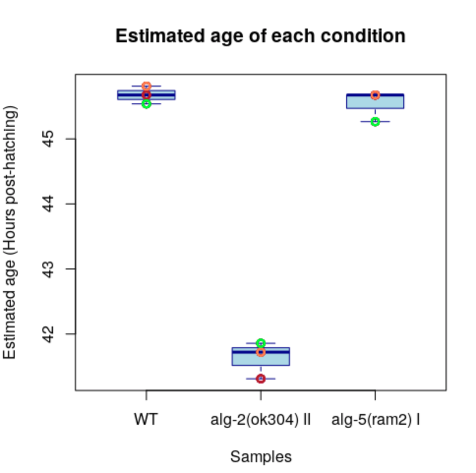{width=60%}
