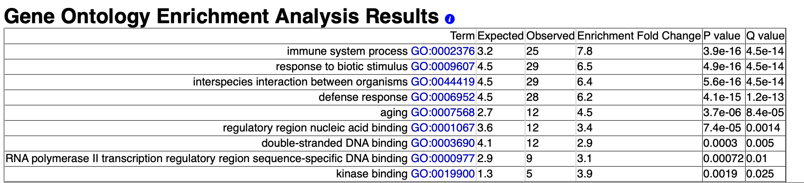

README NGS project.

## Introduction: 

Argonauts are a proteins family involved in gene silencing, they recruit miRNAs which are small RNAs used as guides to find the target RNA and destroy it. 

C.elegans has 25 different Argonaute proteines, these interact with various miRNAs. 

*Brown et al. 2017* generated mutants of several Argonaute proteins and sequenced their transcriptomes to compare them to the wild type. 

Nevertheless, *C. elegans* being a fast developing organism, individuals from a sample can have various ages. Therefore there is an impact of the development stage in the variation observed between strains. A cutting edge tool will be used to assess the degree of impact of development on the results. 

## Software:

### OS
Ubuntu 20.04 LTS.

### Tools: 
- sratoolkit.2.10.0 
- FastQC v0.11.8
- MultiQC 1.9
- Trimmomatic O.39
- Salmon 0.14.1
- RAPToR 1.1.4

## RNA-seq data download: 

Link to the data (Geo database, accession code: GSE98935) `https://www.ncbi.nlm.nih.gov/geo/query/acc.cgi?acc=GSE98935`

Strains (Subset of the article's data): WT, alg-2(ok304) II (Argonaute 2 mutant) and alg-5(ram2) I (Argonaute 5 mutant). There are 3 replicates of each strain. 

Data was downloaded using the **Download_data.sh** script. Using the fastq-dump command. 

Fasta def lines were changed (defline-seq and defline-qual): 

- The sequence defline contains: The accession number, the spot id and the read number 

- The quality defline contains à "+" symbol. 

## Control the reads quality:

### 1) Fastqc analysis:

We used **Fastqc.sh** (one report per sample). Principal command: 

```bash
fastqc $file -o . -t 6
```

### 2) Multiqc analysis:

We used **Multiqc.sh** (on Fastqc directory output, one report for all samples). Principal command: 

```bash
multiqc $data/* -o . 
```

### 3) Results: 

Adapters sequences are present in our reads, that's why in the next step we will remove them.


## Remove adapters from reads: 

### 1) Find adapters sequences:

Adapters' sequences were found in the supplementary data of Brown *et al*, 2017.

We generated reverse complement sequences using the online tool: `http://reverse-complement.com/`

Sequences were written on a Fasta file: **Adapter_sequences.fa**

### 2) Use Trimmomatic to remove adapters:

We used **Trimmomatic.sh**. Principal command: 

```bash
java -jar $TRIMMOMATIC_JAR PE -phred33 $input_1 $input_2 $output_1_paired \
  $output_1_unpaired $output_2_paired $output_2_unpaired ILLUMINACLIP:$adapter:2:30:10\
  LEADING:3 TRAILING:3 SLIDINGWINDOW:4:15 
```

ILLUMINACLIP remove adapters, LEADING remove leading low quality bases, TRAILING remove trailing low quality bases, SLIDINGWINDOW scan the read with a 4-base sliding window and cut when the average quality per base drops below 15. 

Trimmomatic generate two types of outputs, paired sequences (R1+R2) and unpaired sequences (R1 or R2 alone). For the rest of the analysis we will only keep paired sequences.

### 3) Control the reads quality after trimming:

I combined the two scripts of **Fastqc.sh** and **Multiqc.sh** to form the **Control_qual_trim.sh**.

We see on the Multiqc report that there are no (or almost no) more adapters , and that the read lengths are not as homogeneous as before. 


## Transcript expression quantification: 

### 1) Get the reference transcriptome:

The reference transcriptome of *C.elegans* was downloaded: `https://www.ensembl.org/info/data/ftp/index.html`

We used the wget command with this link:  `ftp://ftp.ensembl.org/pub/release-101/fasta/caenorhabditis_elegans/cdna/Caenorhabditis_elegans.WBcel235.cdna.all.fa.gz`

Create an index using the **Transcriptome_index.sh** script

### 2) Run Salmon analysis: 

We used Salmon to quantify the expression of transcripts in each sample:

Run salmon on experimental data using **Salmon.sh**. Principal command: 

```bash
salmon quant -i $data/index_transcriptome -l A \
         -1 $input_1 \
         -2 $input_2 \
         -p 8 --validateMappings -o $quants/${name}_quant
```

-l is for the library type. 

-p is the number of threads that will be used for quasi mapping, quantification and bootstrapping. 

--validateMapping use a more sensitive and accurate mapping algorithm and run an extension alignment dynamic program on the potential mappings it produces.

### 3) Generate a Multiqc report with Salmon output data: 

We used the **Multiqc_after_salmon.sh** script. 


## Import data:

We used tximport to import Salmon quantifications, it creates a matrix with abundance, counts and transcript length. 

After that, we put the matrix in a R object, so it's possible to load the object for future use. 

The script is: **Tximport.R**

```r 
tx2gene = wormRef::Cel_genes[, c("transcript_name", "wb_id")] #load transcript IDs and Gene IDs from wormRef
txi.salmon <- tximport(files, type = "salmon", tx2gene = tx2gene)
```

## Differential expression analyses: 

### 1) Run DESeq: 

DESeq runs a statistical test on gene expression between WT and mutants.

First we estimate the variance from the replicates of each condition. 

We use counts data with DESeq and adapted the matrix as necessary tp run DESeq. 

```r
DESeq_data <- DESeqDataSetFromMatrix(countData = salmon_matrix$counts, #Counts data from tximport
                              colData = salmon_matrix$pdata, #information about samples
                              design= ~ strain) #Conditions 
```

We considered Differentially Expressed genes at a False Discovery Rate (FDR) of 0.05 (as done in Brown *et al.* 2017). 

```r
res_alg2 <- results(dds, name="strain_alg.2.ok304..II_vs_WT", alpha=0.05)
``` 

The WT dataset is the reference, if the Log2 FoldChange is >0 then the genes are upregulated in the mutant. If Log2 FoldChange is <0 then the genes are downregulated in the mutant. 


We found: 

- 1233 up regulated genes and 1621 down regulated genes in Alg2 mutant. 

- 61 up regulated genes and 157 down regulated genes in Alg5 ram2 mutant.

We saved the differentially expressed gene names in csv files. 

### 2) Gene ontology enrichment: 
We used wormbase enrichment tool to assess the enrichment of mutants upregulated and downregulated genes (qvalue = 0.05). `https://wormbase.org/tools/enrichment/tea/tea.cgi`

#### 1- alg2 mutant: 

**Upregulated genes:** (The results differ from the article's, they used different tools, it's not surprising to see a variability) 


**Downregulated genes:** (Fit the article's results)


#### 2- alg5 mutant: 

**Upregulated genes:** (No upregulated genes in the article)


**Downregulated genes:** (Fit the article's results)




## Evaluate the impact of development: 

For that we will use the RAPToR (Real Age Prediction from Transcriptome staging on Reference), an R package that will predict the samples age based on gene expression levels. 

- A temporal reference of genes expression is required beforehand, in our case it will be wormRef, RAPToR will build a high-resolution temporal reference from it.

- RAPToR compares the experimental data to the reference data and gives an estimate of the age.

- After that it performs a Bootstrap to calculate an interval to the age estimate. 

### 1) Install RAPTOR and wormRef on R: 

```r
BiocManager::install("limma")
devtools::install_github("LBMC/RAPToR", build_vignettes = TRUE) devtools::install_github("LBMC/wormRef")
```

### 2) Load wormref: 

We choose: **cell larval to Young Adult** as the right wormRef dataset because our samples are at L4 stage and this dataset covers it. 

We used 500 as the resolution of the interpolated reference. 

```r 
ref_larv <- prepare_refdata("Cel_larv_YA", "wormRef", n.inter = 500) 
```

### 3) Run RAPToR: 

We used RAPToR with abundance data, transcripts per million (TPM). 

```r
ae_data <- ae(samp = salmon_matrix$tpm,                         #input gene expression matrix
                          refdata = ref_larv$interpGE,            #interpolated gene expression
                          ref.time_series = ref_larv$time.series) #Reference time series  
````


### Quantify the impact of development for each strain: 

The DESeq analysis gives us the differentially expressed genes impacted by both the development and the mutation, without being able to differentiate between the two aspects. 

Here we assessed only the development dependent variation. It allows us to determine to which extent variability in development timing affected the observed variations in gene expression.

We used two functions for that: 

- One to get the indices/GExpr of the reference matching sample age estimates. 

```r
getrefTP <- function(ref, ae_obj, ret.idx = T){
  idx <- sapply(ae_obj$age.estimates[,1], function(t) which.min(abs(ref$time.series - t)))
  if(ret.idx)
    return(idx) 
  return(ref$interpGE[,idx])}
``` 

- And then one to compute the reference changes and the observed changes by a linear model (samples input: log1p)

```r
refCompare <- function(samp, ref, ae_obj, fac){
  ovl <- format_to_ref(samp, getrefTP(ref_larv, ae_data, ret.idx = F))
  lm_samp <- lm(t(ovl$samp)~fac)
  lm_ref <- lm(t(ovl$ref)~fac) #Operates a statistical test, but we only keep the log2 fold change.
  return(list(samp=lm_samp, ref=lm_ref, ovl_genelist=ovl$inter.genes)) }

log1p_samp <- log1p(salmon_matrix$tpm)

rc <- refCompare(log1p_samp, ref_larv, ae_data, strain_groups)
```

From the output we measured correlation coefficients: 

- **Alg2 vs Ref for all genes:** 0.6105381
- **Alg2 vs Ref for DE genes:** 0.7321606
  
- **Alg5 vs Ref for all genes:** 0.09306767
- **Alg5 vs Ref for DE genes:** 0.1953245


And we plotted the log1p Fold Change: 


